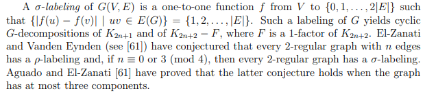
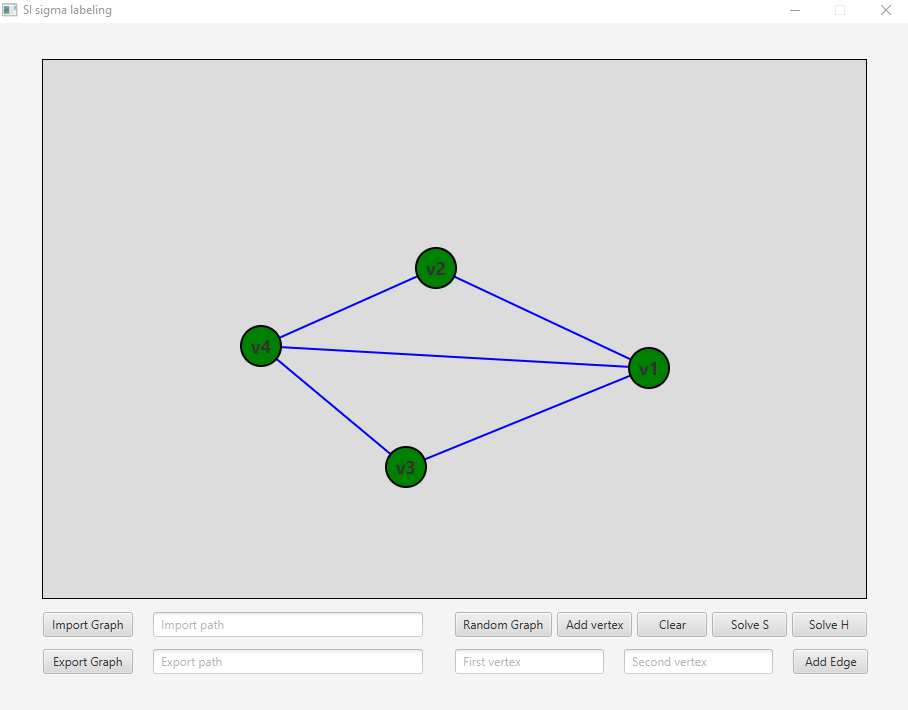

# SI_Project
School project of graph coloring (sigma labeling) using CSP method to solve the problem


## Overall informations
The aplication implements the sigma labeling problem decribed by a fragment below:

>
> 
> -- <cite>Gallian A. Joseph. A Dynamic Survey of Graph Labeling, Twenty-third edition, 2020</cite>

Solution uses the Choco Solver library for Java that can be found [here](https://choco-solver.org/)

Java FX is also used as a tool for creating a graphic user interface.

## Running 
The aplication can be run using the maven project with `pom.xml` and with the usage of the integrated JavaFX.
Project can be also run from a `.jar` file if any is available in the github relases.
## Using the application
### Solving
Solving is made possible using the two buttons described as `Solve S` and `Solve H`. 
First one is the core solving functionality and is one to one representation of the cite above.
It allows a duplications of edge values and it is named soft solve. The other option is hard solve. It ensures that all of the edges get unique value.
### Side functionality
The application contains one and only window allowing the user to load graphs in the specific JSON format, 
saving them and randomly generating. App is also capable of clearing current graph and creating new vertexes and
edges between them. The image below show this main window with a random generated graph.



### JSON File formatting
The JSON format is containing a two list of object representing vertices and edges in the graph.
Default value is edge coloring is 0 and it is not shown i the program as the coloring can not get this value.
If all edge values are equal to 1 it means that there was no solution to given problem (Only if there are more than one edge).
Fragment below shows how to describe a correct file.

```json
{
  "vertices": [
    {
      "name": "v",
      "id": "1",
      "label": "v1"
    },
    {
      "name": "v",
      "id": "2",
      "label": "v2"
    }
  ],
  "edges": [
    {
      "color": "1",
      "firstV": "v1",
      "secondV": "v2"
    }
  ]
}
```

